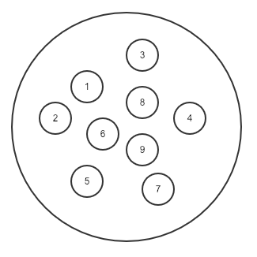
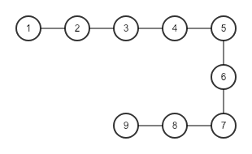
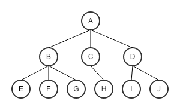
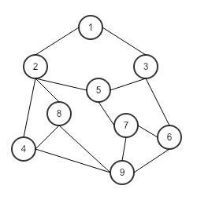
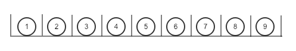
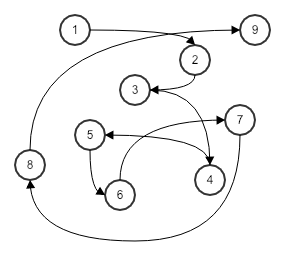
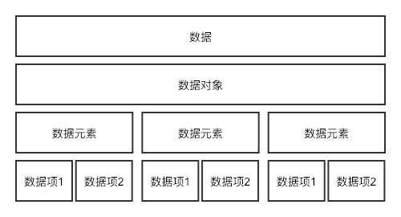
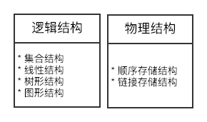

# 数据结构绪论

## 数据结构起源
数据结构是一门研究非数值计算的程序设计问题中的操作对象，以及它们之间的关系和操作等相关问题的科学。

## 基本概念和术语
* **数据：** 数据是描述客观事物的符号，是计算机中可以操作的对象，是能被计算机识别，并输入给计算机的符号集合。 
* **数据元素：** 是组成数据的、有一定意义的基本单位，在计算机中通常作为整体处理，也被称为记录。 
* **数据项：** 一个数据元素由若干个数据项组成，数据项是数据不可分割的最小单位。 
* **数据对象：** 是性质相同的数据元素的集合，是数据的子集。 
* **数据结构：** 是相互之间存在一种或多种特定关系的数据元素的集合。 

## 逻辑结构与物理结构
### 逻辑结构
是指数据对象中数据元素之间的相互关系。 

* **集合结构：** 集合结构中的数据元素除了同属于一个集合外，它们之间没有其他关系。 

* **线性结构：** 线性结构中的数据元素之间是一对一的关系。  

* **树形结构：** 树形结构中的数据元素之间存在一种一对多的层次关系。  

* **图形结构：** 图形结构的数据元素是多对多的关系。  


### 物理结构
是指数据的逻辑结构在计算机中的存储形式  

* **顺序存储结构：** 是把数据元素存放在地址连续的存储单元里，其数据间的逻辑关系和物理关系是一致

* **链式存储结构：** 是把数据元素存放在任意的存储单元里，这组存储单元可以是连续的，也可以是不连续的。


### 抽象数据类型
* **数据类型：** 是指一组性质相同的值得集合及定义在此集合上的一些操作的总称。  
	* **原子类型：** 是不可以再分解的基本类型，包括整型、实型、字符型等。  
	* **结构类型：** 由若干个类型组合而成，可以是再分解的。例如：整形数组是由若干整形数据组成的。 
* **抽象数据类型（Abstract Data Type， ADT）：** 是指一个数学模型及定义在该模型上的一组操作。  

	```
	ADT 抽象数据类型名
	Data
		数据元素之间逻辑关系的定义
	Operation
		操作1
			初始条件
			操作结果描述
		操作2
			……
		操作n
			……
	endADT
	
	```
	
### 总结回顾
* 数据结构概念  

* 数据结构分类  

