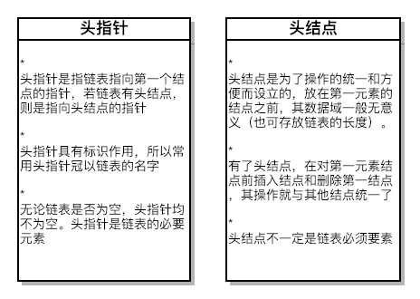
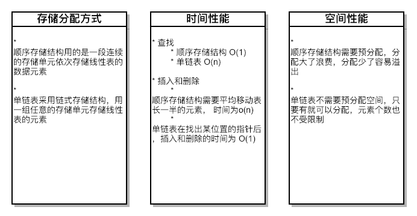
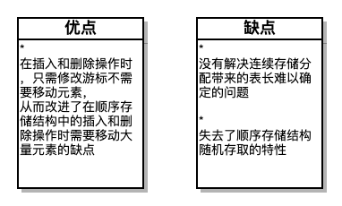

# 线性表

## 线性表的定义
**线性表：零个或多个数据元素的有限序列**  

若使用数学语言定义：  
**若将线性表记为（a<sub>1</sub>, ..., a<sub>i-1</sub>, a<sub>i</sub>, a<sub>i+1</sub>, ..., a<sub>n</sub>）则表中a<sub>i-1</sub>领先于a<sub>i</sub>, a<sub>i</sub> 领先于a<sub>i+1</sub>，称a<sub>i-1</sub>是a<sub>i</sub>的直接前驱元素，a<sub>i+1</sub>是a<sub>i</sub>的直接后继元素。当 i=1, 2, ..., n-1 时，a<sub>i</sub>有且仅有一个直接后继，当 i=2, 3, ..., n时，a<sub>i</sub>有且仅有一个直接前驱**  
所以  
**线性表元素的个数 n (n≥0)定义为线性表的长度，当n=0时，称为空表**

## 线性表的抽象数据类型

```
 ADT 线性表(List)
 Data
     线性表的数据对象集合为{a1,a2,...,an}, 每个元素的类型均为 DataType。
     其中除第一个元素a1外，每一个元素有且仅有一个直接前驱元素，
     除了最后一个元素an外，每一个元素有且仅有一个直接后继元素。
     数据元素之间的关系是一对一的关系
 Operation
     InitList(*L):          初始化操作，建立一个空的线性表 L。
     ListIsEmpty(L):        若线性表为空，返回 true, 否则返回false。
     ClearList(*L);         将线性表置空
     GetElem(L,i,*e):       将线性表 L 的第 i 个元素返回给 e。
     LocateElem(L, e):      在线性表 L 中查找与给定值 e 相等的元素，若查找成功，返回该元素在表中序号表示成功，否则返回0表示失败
     ListInsert(*L,i,e):    在线性表 L 中第 i 个位置插入新元素 e。
     ListDelete(*L,i,*e):   删除线性表中第 i 个位置的元素，并用 e 返回其值。
     ListLength(L):         返回线性表 L 的元素个数
 endADT
```

## 线性表的顺序存储结构
**顺序存储定义：** 线性表的存储结构，指的是用一段地址连续的存储单元依次存储线性表的数据元素  
**顺序存储方式：** 可以用一维数组来实现顺序存储结构  

```c
#define MAXSIZE 20              // 存储空间初始分配量
typedef int ElemType;           // ElemType类型根据实际情况而定, 这里假设为 int
typedef struct {
    ElemType data[MAXSIZE];     // 数组存储元素, 最大值为 MAXSIZE
    int length;                 // 线性表当前元素
} SqList;
```
**数组长度与线性表长度的区别：** 数组长度是存放线性表的存储空间长度，线性表长度是线性表中元素的个数。  
**地址：** 存储器中的每个存储单元都有自己编号，这个编号称为地址。  

## 顺序存储结构的插入与删除
### 获得元素的操作  
```c
// 相关操作状态定义
#define OK 1
#define ERROR 0
#define TRUE 1
#define FALSE 0
typedef int  Status;            // Status 是函数的类型,其值是函数结果状态码,如 OK 等

/**
 获取线性表中第 i 个元素
 
 @param L 线性表 L, 必须已存在
 @param i 要获取的编号, 需满足 i ≤ i ≤ ListLength(L)
 @param e 对应元素返回
 @return 操作结果 OK/ERROR
 */
Status GetSqListElem(SqList L, int i, ElemType *e) {
    if (L.length==0 || i<1 || i>L.length) return ERROR;
    *e = L.data[i-1];
    return OK;
}

```

### 插入操作
```c
/**
 向线性表的第 i 个位置插入元素
 
 @param L 线性表, 必须存在
 @param i 位置编号, 需满足 i ≤ i ≤ ListLength(L)
 @param e 要插入的元素
 @return 操作结果 OK/ERROR
 */
Status SqListInsert(SqList *L, int i, ElemType e) {
    
    // 顺序线性表已满
    if (L->length == MAXSIZE) return ERROR;
    // i 不在线性表范围内
    if (i<1 || i>L->length+1) return ERROR;
    // 插入数据位置不在表尾部
    if (i<=L->length) {
        // 将要插入位置后的元素统一后移一位
        for (int k=L->length-1; k>=i-1; k--) {
            L->data[k+1] = L->data[k];
        }
    }
    L->data[i-1] = e;
    L->length ++;

    return OK;
}
```

### 删除操作

```c
/**
 删除线性表第 i 个位置的元素
 
 @param L 线性表, 必须存在
 @param i 要删除的位置编号, 需满足 i ≤ i ≤ ListLength(L)
 @param e 被删除的元素返回
 @return 操作结果 OK/ERROR
 */
Status SqListDelete(SqList *L, int i, ElemType *e) {
    
    // 空表
    if (L->length==0) return ERROR;
    // 要删除的位置不正确
    if (i<1 || i>L->length) return ERROR;
    *e = L->data[i-1];
    // 若删除的不是表尾, 将删除位置后继元素前移
    if (i<L->length) {
        for (int k=i; k<L->length; k++) {
            L->data[k-1] = L->data[k];
        }
    }
    L->length --;
    
    return OK;
}
```
## 线性表的链式存储结构

### 线性表链式存储结构的定义
为了表示每个数据元素 a<sub>i</sub> 与其直接后继元素 a<sub>i+1</sub> 之间的逻辑关系，对数据元素 a<sub>i</sub> 来说，出了存储其本身的信息之外，还需存储一个指示其直接后继的信息（即直接后继的存储位置）。把存储数据元素信息的域称为数据域，把存储直接后继位置的域称为指针域。指针域中存储的信息乘坐指针或链。这两部分信息组成数据元素 a<sub>i</sub> 的存储映像，称为结点（Node）。  

n 个节点（a<sub>i</sub>的存储映像）链接成一个链表，即为线性表 (a<sub>1</sub>, a<sub>2</sub>, ..., a<sub>n</sub>) 的连式存储结构，因为此链表的每个节点中只包含一个指针域，所以叫做**单链表**。

链表中第一个节点的存储位置叫做**头指针**

有时，为了更加方便的对链表进行操作，会在单链表的第一个结点前附设一个结点，称为**头结点**

### 头指针和头结点的异同



### 线性表链式存储结构代码描述

```c
/**
 线性表的单链表的存储结构
 
 结点由存放数据元素的数据域和存放后继结点地址的指针域组成
 */
typedef struct Node {
    ElemType data;
    struct Node *next;
} Node;

// 定义 LinkList
typedef struct Node *LinkList;
```

## 单链表的读取
```c
/**
 获取单链表第i 个位置的元素
 
 @param L 单链表, 必须存在
 @param i 要获取元素的位置标号 1 ≤ i ≤ ListLength(L)
 @param e 返回元素
 @return 操作是否成功 OK/ERROR
 */
Status GetLinkListElem(LinkList L, int i, ElemType *e) {
    
    LinkList p = L->next;
    int j = 1;
    
    while (p && j<i) {
        p = p->next;
        ++j;
    }
    if (!p || j > i) {
        return ERROR;
    }
    *e = p->data;
    return OK;
}
```

## 单链表的插入与删除
### 单链表的插入

```c
/**
 向单链表第 i 个位置插入元素
 
 @param L 单链表, 必须存在
 @param i 要插入的位置标号, 1 ≤ i ≤ ListLength(L)
 @param e 要插入的元素
 @return 操作结果 OK/ERROR
 */
Status LinkListInsert(LinkList *L, int i, ElemType e) {
    
    LinkList p = *L;
    int j = 1;
    
    while (p && j<i) {
        p = p->next;
        ++j;
    }
    // 第 i 个元素不存在
    if (!p || j >i) return ERROR;
    
    // 生成一个新节点
    LinkList s = (LinkList)malloc(sizeof(Node));
    
    // 插入元素
    s->data = e;
    s->next = p->next;
    p->next = s;
    return OK;
}
```

### 单链表的删除

```c
/**
 移除单链表的第 i 个位置的元素
 
 @param L 单链表,必须存在
 @param i 要移除元素的位置标号, 1 ≤ i ≤ ListLength(L)
 @param e 要删除的元素返回
 @return 操作结果 OK/ERROR
 */
Status LinkListDelete(LinkList *L, int i, ElemType *e) {
    
    LinkList p = *L;
    int j = 1;
    while (p && j < i) {
        p = p->next;
        ++j;
    }
    // 第 i 个节点不存在
    if (!p->next || j > i) return ERROR;
    
    LinkList q = p->next;
    p->next = q->next;
    *e = q->data;
    free(q);
    
    return OK;
}
```

## 单链表的整表创建
**头插法**

```c
/**
 随机产生 n 个元素的值, 建立带表头节点的单链线性表 L(头插法)
 
 @param L 创建的线性表 L 返回
 @param n 表元素个数
 @return 操作结果 OK/ERROR
 */
Status CreateLinkListHead(LinkList *L, int n) {
    
    srand((unsigned int)time(0));
    *L = (LinkList)malloc(sizeof(Node));
    (*L) -> next = NULL;
    for (int i=0; i<n; i++) {
        LinkList p = (LinkList)malloc(sizeof(Node));
        p->data = rand() % 100 + 1;
        p->next = (*L)->next;
        (*L)->next = p;
    }
    return OK;
}
```

**尾插法**

```c
/**
 随机产生 n 个元素的值, 建立带表头节点的单链线性表 L(尾插法)
 
 @param L 创建的线性表 L 返回
 @param n 表元素个数
 @return 操作结果 OK/ERROR
 */
Status CreateLinkListTail(LinkList *L, int n) {
    
    srand((unsigned int)time(0));
    (*L) = (LinkList)malloc(sizeof(Node));
    LinkList r = *L;
    
    for (int i=0; i<n; i++) {
        LinkList p = (Node *)malloc(sizeof(Node));
        p->data = rand()%100+1;
        r->next = p;
        r = p;
    }
    r->next = NULL;
    return OK;
}

```

## 单链表的整表删除

```c
/**
 清空单链表
 
 @param L 单链表, 必须存在
 @return 操作结果 OK/ERROR
 */
Status ClearLinkList(LinkList *L) {
    
    LinkList p = (*L)->next;
    while (p) {
        LinkList q = p->next;
        
        free(p);
        p=q;
    }
    (*L)->next = NULL;
    return OK;
}
```

## 单链表结构与顺序存储结构优缺点


## 静态链表
......用数组描述的链表叫静态链表（游标实现法）

#### 静态链表的定义
```c
#define MAXSIZE_FOR_STATICLINKLIST 1000
typedef struct {
    ElemType data;
    int cur;
} Component, StaticLinkList[MAXSIZE_FOR_STATICLINKLIST];
```

#### 静态链表的初始化
```c
/**
 初始化一个静态链表
 
 @param space 静态链表
 @return 初始化结果
 */
Status InitStaticLinkList(StaticLinkList space) {
    int i;
    for (i=0; i<MAXSIZE_FOR_STATICLINKLIST-1; i++) {
        space[i].cur = i+1;
        space[i].data = 0;
    }
    space[MAXSIZE_FOR_STATICLINKLIST-1].cur=0;
    return OK;
}
```
#### 静态链表模拟动态链表的内存分配和释放
```c
/**
 模拟动态链表存储空间的分配
 
 @param space 静态链表
 @return 若备用空间链表非空, 则返回分配的节点下标, 否则返回0
 */
int Malloc_SLL(StaticLinkList space) {
    // 数组第0位,始终记录静态链表下一个可用位置
    int i = space[0].cur;
    if (space[0].cur) {
        space[0].cur = space[i].cur;
    }
    return i;
}

/**
 模拟动态l链表存储空间的释放
 
 @param space 静态链表
 @param k 要释放的位置
 */
void Free_SLL(StaticLinkList space, int k) {
    space[k].cur = space[0].cur;
    space[0].cur = k;
}

```

#### 静态链表的插入
```c
/**
 静态链表的插入实现
 
 @param space 静态链表
 @param i 要插入的位置
 @param e 要插入的内容
 @return 插入结果
 */
Status StaticLinkListInsert(StaticLinkList space, int i, ElemType e) {
    int j, k, l;
    k = MAXSIZE_FOR_STATICLINKLIST-1;
    if (i<1 || i>StaticLinkListLength(space)+1) return ERROR;
    j = Malloc_SLL(space);
    if (!j) return ERROR;

    space[j].data = e;
    for (l=1; l<i; l++) {
        k = space[k].cur;
    }
    space[j].cur = space[k].cur;
    space[k].cur = j;

    return OK;
}
```

#### 静态链表的删除

```c
/**
 静态链表的删除实现
 
 @param space 静态链表
 @param i 要删除的元素编号
 @return 删除结果
 */
Status StaticLinkListDelete(StaticLinkList space, int i) {
    int j, k;
    
    if (i<1 || i> StaticLinkListLength(space)) return ERROR;
    k = MAXSIZE_FOR_STATICLINKLIST-1;
    for (j=1; j<i; j++) {
        k = space[k].cur;
    }
    
    j = space[k].cur; // space[k] 为要删除元素的前一个
    space[k].cur = space[j].cur;
    Free_SLL(space, j);
    
    return OK;
}
```

#### 静态链表的长度计算
```c
/**
 获取链表长度
 
 @param space 静态链表
 @return 链表长度
 */
int StaticLinkListLength(StaticLinkList space) {
    int j=0;
    int i = space[MAXSIZE_FOR_STATICLINKLIST-1].cur;
    
    while (i) {
        i = space[i].cur;
        j++;
    }
    
    return j;
}
```

### 静态链表的优缺点



## 循环链表
**将单链表中终端节点的指针端由空指针改为指向头结点， 就使整个单链表形成一个环， 这种头尾相接的单链表称为循环连链表（circular linked list）**

### 循环链表的合并
```c
/**
 合并两个单循环链表
 
 @param list 主单循环链表
 @param anotherList 从单循环链表
 @return 操作是否成功
 */
Status UnionCircularLinkList(CircularLinkList *list, CircularLinkList *anotherList) {
    
    CircularLinkList rearA = (*list);
    CircularLinkList rearB = (*anotherList);
    
    while (rearA->next != *list) {
        rearA = rearA->next;
    }
    while (rearB->next != *anotherList) {
        rearB = rearB->next;
    }
    
    rearA->next = (*anotherList)->next;
    rearB->next = (*list);

    free((*anotherList));
    *anotherList = NULL;

    return OK;
}
```


